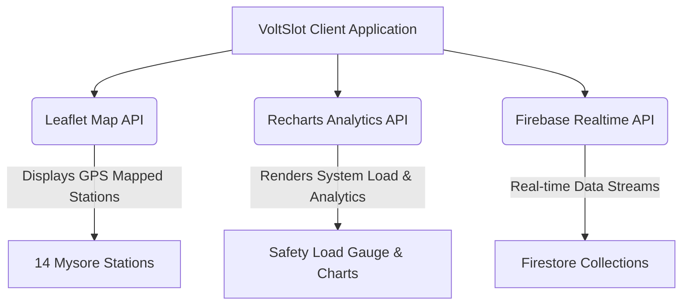

# VoltSlot: Architecture & Technical Reference Manual

This manual provides an exhaustive compilation of all **frameworks, libraries, APIs, database architectures, and engineering references** utilized to design, build, and deploy the **VoltSlot** (previously named **Smart Slot Charge**) EV charging slot booking and load management application.

---

## 1. Core Development Framework & Runtime

VoltSlot is built upon a modern, fast, and secure client-side foundation optimized for real-time reactivity and performance.

| Core Technology | Version | Description & Role in VoltSlot | Official Reference Link |
| :--- | :--- | :--- | :--- |
| **React** | `^18.3.1` | The structural UI library. Coordinates interactive layouts, state-driven rendering (contexts), and modular component cycles. | [React Documentation](https://react.dev/) |
| **Vite** | `^5.4.19` | Next-generation frontend tooling and bundler. Powers hot-module replacement (HMR), production bundling, and local development environment setup. | [Vite Documentation](https://vitejs.dev/) |
| **TypeScript** | `^5.8.3` | Strongly-typed programming language that builds on JavaScript. Prevents compile-time errors in booking contexts, API integration, and mathematical load algorithms. | [TypeScript Documentation](https://www.typescriptlang.org/) |

---

## 2. Real-Time Cloud Infrastructure (Firebase)

The application utilizes **Google Cloud Firebase** for backend services, data synchronization, security controls, and authentication.

| Firebase Module | Version | Description & Role in VoltSlot | Official Reference Link |
| :--- | :--- | :--- | :--- |
| **Cloud Firestore** | `^10.12.5` | NoSQL document database used for real-time updates. Keeps active bookings, slots availability, payments, and users instantly synchronized across client sessions via `onSnapshot` listeners. | [Firestore Documentation](https://firebase.google.com/docs/firestore) |
| **Firebase Auth** | `^10.12.5` | Handles secure sign-in/sign-up. Used to authenticate drivers and distinguish admin accounts via Firestore-stored roles. | [Firebase Auth Documentation](https://firebase.google.com/docs/auth) |
| **IndexedDB Caching** | — | Offline persistence layer enabled within the Firestore SDK. Allows VoltSlot to display cached charging stations and survive brief network dropouts. | [Firestore Offline Persistence](https://firebase.google.com/docs/firestore/manage-data/enable-offline) |
| **Firebase Tools** | `^13` | Command-line interface (CLI) used to configure, initialize, seed, and manage services in your `voltslot-60a4c` Firestore project. | [Firebase CLI Reference](https://firebase.google.com/docs/cli) |

---

## 3. Advanced UI Components & Design System

VoltSlot adheres to a high-premium, responsive "future-city energy grid" design with neon accents, dark mode capabilities, and interactive micro-animations.

| UI Library | Version | Description & Role in VoltSlot | Official Reference Link |
| :--- | :--- | :--- | :--- |
| **Tailwind CSS** | `^3.4.17` | Utility-first CSS framework. Coordinates responsiveness, layout grids, neon colors, and customized thematic values. | [Tailwind CSS Documentation](https://tailwindcss.com/) |
| **Radix UI Primitives** | Various | Fully accessible, unstyled UI primitives. Powers advanced structural modules like dialog overlays, navigation bars, popovers, select forms, and tabs. | [Radix UI Documentation](https://www.radix-ui.com/) |
| **shadcn/ui** | Custom | Reusable custom React components constructed on top of Radix UI primitives and styled with Tailwind. Configured via `components.json` and `tailwind.config.ts`. | [shadcn/ui Documentation](https://ui.shadcn.com/) |
| **Framer Motion** | `^12.38.0` | Custom animation engine. Controls page transitions, load gauge pulsations, sliding cards, and notification alerts. | [Framer Motion Docs](https://www.framer.com/motion/) |
| **Lucide React** | `^1.8.0` | Beautifully consistent, pixel-perfect icon pack for modern dashboard components, navigation sidebar, and category labels. | [Lucide Icons Guide](https://lucide.dev/) |

---

## 4. Special Core APIs & Visualizations

VoltSlot incorporates geographical maps and analytics dashboards for EV charging networks and substation loads.



### 4.1 Geographical Mapping APIs (Leaflet)
*   **Leaflet (`^1.9.4`) & React Leaflet (`^4.2.1`)**: Used to construct the interactive map and custom markers representing the **14 EV charging stations located in Mysore, India** (e.g., VoltSlot Mysore Palace, Vijayanagar, Chamundi Hill).
*   **Official Resources**:
    *   [Leaflet.js Reference](https://leafletjs.com/)
    *   [React Leaflet Documentation](https://react-leaflet.js.org/)

### 4.2 Data Visualization APIs (Recharts)
*   **Recharts (`^2.15.4`)**: Used to build custom dashboard visualizations for administrators:
    *   **Peak Hours Demand**: Bar Chart illustrating grid reservation volumes.
    *   **Revenue by Charger Type**: Pie Chart outlining Fast vs Normal charger revenue.
    *   **Substation Load Tracker**: Live Line Chart matching concurrent usage (kW) against maximum safety threshold.
*   **Official Resources**:
    *   [Recharts Documentation](https://recharts.org/)

---

## 5. State Management & Utility Tooling

| Package | Version | Description & Role in VoltSlot | Official Reference Link |
| :--- | :--- | :--- | :--- |
| **React Router Dom** | `^6.30.1` | Declarative routing system. Handles redirection for `/`, `/auth`, `/admin`, `/bookings`, and restricted admin routing. | [React Router Docs](https://reactrouter.com/) |
| **TanStack React Query** | `^5.83.0` | Powerful server-state framework. Facilitates background refreshing, loading states, cache invalidation, and data synchronization. | [TanStack Query Docs](https://tanstack.com/query) |
| **Zod** | `^3.25.76` | Type-safe schema validation. Ensures runtime stability of booking payload shapes, pricing parameters, and configuration forms. | [Zod Documentation](https://zod.dev/) |
| **React Hook Form** | `^7.61.1` | High-performance, lightweight form management library. Handles form validation seamlessly. | [React Hook Form Docs](https://react-hook-form.com/) |
| **date-fns** | `^4.1.0` | Modern, functional JS date utility library. Essential for generating 30-min time slots, calculating durations, formatting calendar entries, and verifying overlap collisions. | [date-fns Documentation](https://date-fns.org/) |
| **Embla Carousel** | `^8.6.0` | Flexible carousel component. Powers smooth slider elements inside location drawers and features guides. | [Embla Carousel Docs](https://www.embla-carousel.com/) |

---

## 6. Development Tools & Code Scaffolders

*   **Lovable Tagger (`^1.1.13`)**: Used to manage tag properties for interactive UI assembly and scaffolding of React code templates.
*   **Vitest (`^3.2.4`) & Testing Library (`^16.0.0`)**: Configured via `vitest.config.ts` for headless component testing and validation of the Substation Safety Load Balancer.

---

## 7. Core Application Algorithms & Formulas

To explain the logic built into the project, reference these formulas and calculations documented inside the source code (`voltslot_complete_pseudocode.md` and `BookingContext.tsx`):

### 7.1 Booking Pricing Formula
The total cost of an EV reservation is calculated dynamically based on charger speed (kW) and duration:
$$\text{Cost} = \text{Price per Minute} \times \text{Duration (minutes)}$$
*   **Normal Charger (7.4 kW AC)**: Rate configured globally at **₹2/min** ($\approx$ ₹120/hour).
*   **Fast Charger (50 kW DC)**: Rate configured globally at **₹5/min** ($\approx$ ₹300/hour).

### 7.2 Safety Load Balancing Formula
Before activating bookings or reporting grid usage, the grid load is checked:
$$\text{Total Active Load (kW)} = \sum_{i \in \text{active sessions}} \text{Power Rating}_i \text{ (kW)}$$
*   If the Total Active Load exceeds the safety threshold limit (e.g. 500 kW), safety alerts are triggered in the admin console.
*   Dynamic load throttling can reduce charging speeds proportionally by the following ratio:
$$\text{Reduction Ratio} = \frac{\text{Auto Reduce Threshold}}{\text{Total Active Load}}$$

---

## 8. Database Architecture Schema (Firestore)

VoltSlot utilizes **6 collections** matching relationships in a hybrid SQL/NoSQL structure:

```
┌─────────────────┐             ┌─────────────────┐
│     users       │             │    bookings     │
├─────────────────┤             ├─────────────────┤
│ id (UID)   [PK] │ 1      Many │ id         [PK] │ ◄──────┐
│ fullName        │ ──────────► │ user_id    [FK] │        │
│ email           │             │ charger_id [FK] │        │ 1
│ role            │             │ date            │        │
└─────────────────┘             │ duration_min    │        │
                                │ amount          │        │
┌─────────────────┐             │ status          │        │
│    stations     │             └─────────────────┘        │
├─────────────────┤                                        │ 1
│ id         [PK] │ 1                                      │
│ name            │ ───┐                                   │
│ address         │    │                                   │
│ latitude        │    │                                   │
│ longitude       │    │ Many                              │
└─────────────────┘    └──────► ┌─────────────────┐        │
                                │    chargers     │        │
                                ├─────────────────┤        │
                                │ id         [PK] │ ───────┘
                                │ name            │ ───┐
                                │ status          │    │
                                │ power_kw        │    │
                                │ charger_type    │    │ 1
                                │ price_per_min   │    │
                                │ station_id [FK] │    │
                                └─────────────────┘    │ Many
                                                       ▼
                                ┌─────────────────┐
                                │     slots       │
                                ├─────────────────┤
                                │ id         [PK] │
                                │ date            │
                                │ start_time      │
                                │ status          │
                                │ charger_id [FK] │
                                └─────────────────┘
```

For a detailed walkthrough, refer to the following project documentations:
1. [Firestore Schema Details](file:///c:/Users/Mittal/Downloads/voltslot-main/voltslot-main/FIRESTORE_SCHEMA.md)
2. [Database Structure Overview](file:///c:/Users/Mittal/Downloads/voltslot-main/voltslot-main/DATABASE_STRUCTURE.md)
3. [Instructor Summary Slides](file:///c:/Users/Mittal/Downloads/voltslot-main/voltslot-main/FIREBASE_TABLES_FOR_INSTRUCTOR.md)
